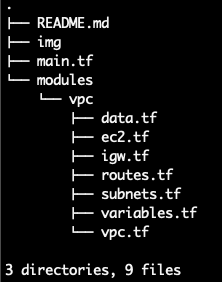

# VPC with NAT instance

The general purpost of this project is to create a new VPC with NAT instance. The following modules was used to create this environment: 

- EC2
- VPC

#### Directory structure

#### Modules

* **VPC**

This module is responsible to create all VPC configuration, including NAT using an EC2 instance.

* **main.tf**

Root configuration responsible to linking another modules and also have the provider settings.

#### Terraform Init

First of all you need to configure your AWS credentials inside this file `/home/USERNAME/.aws/credentials`. Then run:

> terraform init

This command will download the modules dependencies.

#### Terraform Plan

We can validate changes that will be applied on our AWS account with the below command:

> terraform plan

#### Terraform Apply

Finally we can apply the changes running this:

> terraform apply

#### Terraform Destroy

If you not satisfied with this configuration, just remove all the things with this:

> terraform destroy

#### References

Learn about [Terraform](https://learn.hashicorp.com/terraform)
